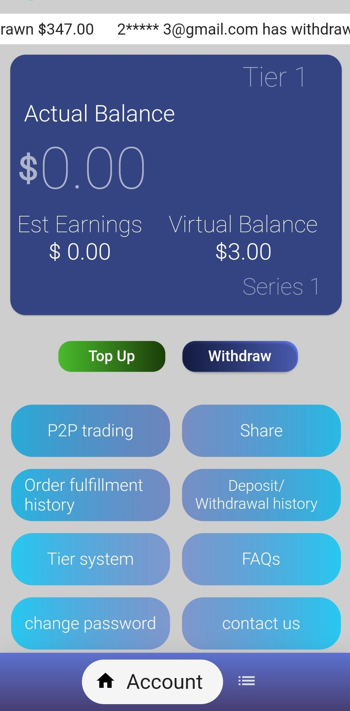
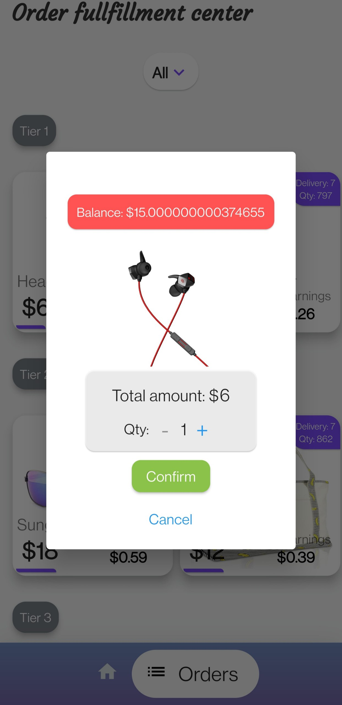
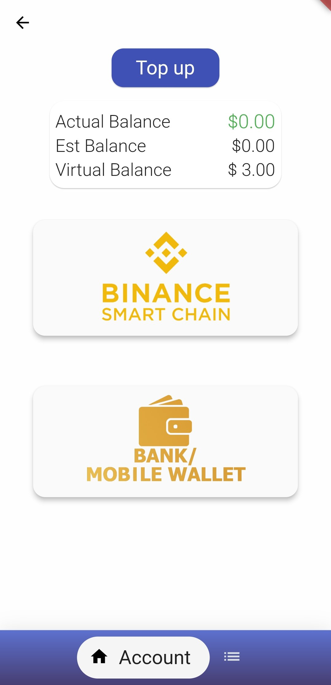
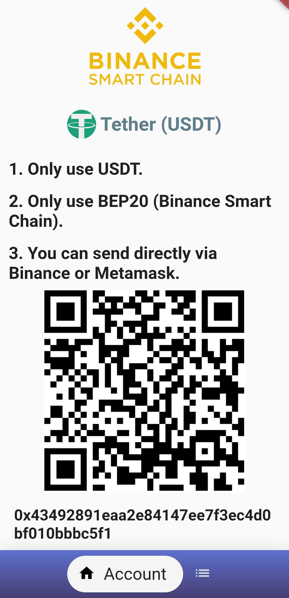
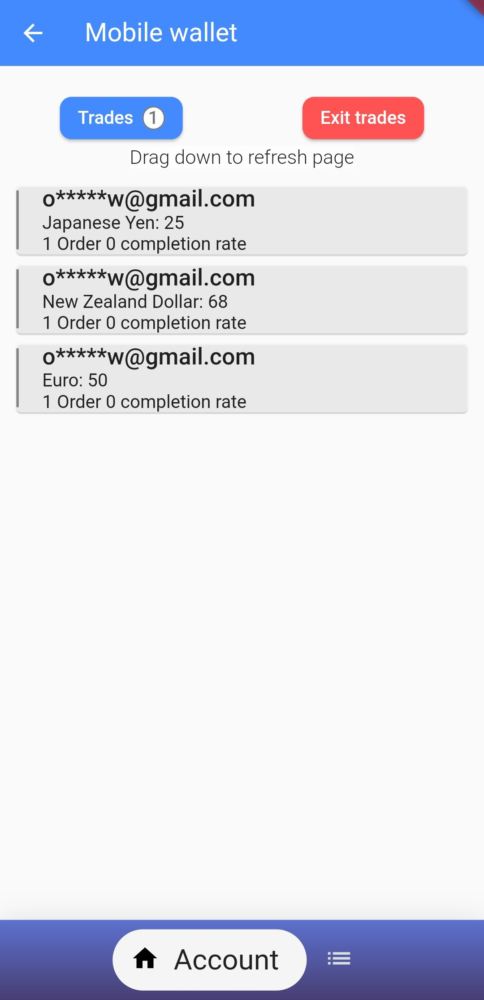
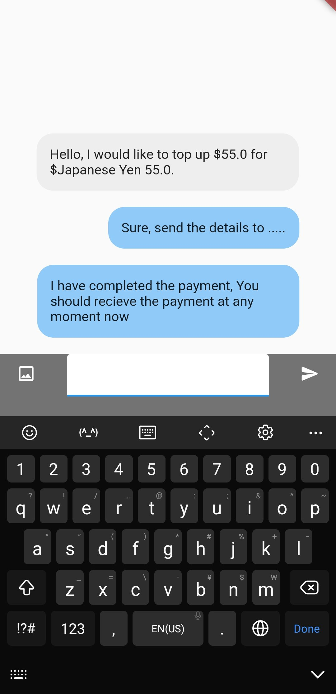

# Prime Basket

Prime Basket is a next-generation order fulfillment platform that seamlessly integrates e-commerce with crypto-based payment solutions. Designed as an update to the previous Prime Basket application on Google Play Store, this project enhances the original system by introducing a refined architecture and improved functionality, ensuring a seamless and rewarding user experience.

## Table of Contents
* [General Info](#general-information)
* [Technologies Used](#technologies-used)
* [Features](#features)
* [Screenshots](#screenshots)
* [Acknowledgements](#acknowledgements)
* [Contact](#contact)

## General Information
- Prime Basket is a **peer-to-peer (P2P) order fulfillment platform** that enables users to **top up their balance, fulfill orders for businesses, and earn rewards based on their tier level**.
- Users progress through **subscription-based tiers** depending on the number of fulfilled orders, unlocking higher rewards.
- The platform provides flexible **withdrawal options**, allowing users to cash out their earnings either to a **crypto wallet (USDT via BSC Scan API)** or a **bank account**.
- This project was developed in 2023 for a client on Upwork, built from the ground up as an **enhanced update** of the previous Prime Basket app available on the Play Store.

## Technologies Used
- **Flutter** – Cross-platform mobile development
- **Firebase** – Backend services for authentication and data storage
- **BSC Scan API** – Integration for seamless crypto transactions

## Features
Prime Basket offers an extensive range of powerful features:
- **P2P Order Fulfillment** – Users complete orders for businesses and progress through reward tiers.
- **Subscription-Based Tiers** – Rewards scale based on order history and engagement.
- **Top-Up System** – Users can deposit funds into the platform to start fulfilling orders.
- **Crypto & Bank Withdrawals** – Balance can be withdrawn to either a **crypto wallet (USDT via BSC)** or a **bank account**.
- **Real-Time Earnings Tracking** – Users can monitor their tier-based earnings in real-time.
- **Secure Transactions** – Ensures safe fund transfers with blockchain-backed security.

## Screenshots

| Home Page              | Order Fulfillment Page  | Top-Up Page            |
| ---------------------- | ---------------------- | ---------------------- |
|  |  |  |

| Deposit Crypto Page   | Trades Screen          | Escrow Chat Screen     |
| ---------------------- | ---------------------- | ---------------------- |
|  |  |  |

## Acknowledgements
- This project was made possible through **BSC Scan API**, which provided seamless crypto transaction support.
- Special thanks to the client for entrusting this project and allowing the development of an improved version of Prime Basket.

## Contact
Created by [@OBRND](https://github.com/OBRND) - feel free to contact me!  

